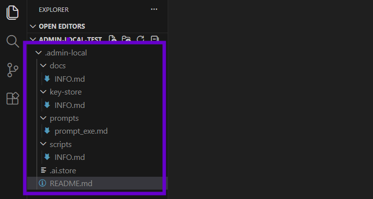

# Admin Local

**Export/import your AI keys, prompts, and scripts between projects. Never commit secrets to Git.**



## Why?

**Save 30 minutes every new project.** Stop hunting for API keys or recreating scripts. Export from one project, import to another.

## What You Get

Right-click menu with 4 commands:
- **Initialize** - Creates `.admin-local` folder (Git-ignored, local-only)
- **Export** - Zip everything to timestamped `.admloc` file
- **Import** - Restore from `.admloc` file
- **Delete** - Remove folder

**Folder structure:**
```
.admin-local/
  ├── .ai.store           # API keys (OpenAI, Anthropic, etc.)
  ├── prompts/            # Reusable prompts
  └── scripts/            # Helper scripts
```

## How It Works

**Workflow:**  
Project A: Initialize → Add keys/prompts → Export → `project-a-admin-local-2026-03-30.admloc`  
Project B: Initialize → Import → Select `.admloc` → Done

**Security:** Uses `.git/info/exclude` (local Git ignore). Impossible to commit. Zero team impact.

## Use Cases

**AI Development:** API keys, prompt templates, test scripts  
**AWS/Cloud:** IAM credentials, deployment scripts  
**Database:** Connection strings, seed data  
**Any Project:** Secrets that shouldn't be in `.gitignore`

## Installation

**From VSIX:**  
Extensions → `...` → Install from VSIX → Select `admin-local-0.0.1.vsix`

**From Marketplace** (coming soon):  
Search "Admin Local"

## Requirements

VS Code 1.109.0+ • Git repository • Git installed

---

**MIT License** | Created by Shaun Allen Pritchard


**The reason this extension exists:** Move your workflow between projects effortlessly.

**Export** from a finished project:
```
Right-click → Admin Local: Export Archive
→ Saves: project-name-admin-local-2026-03-30T12-30-45.admloc
```

**Import** into a new project:
```
Right-click → Admin Local: Import Archive
→ Select your .admloc file
→ Done! All keys, prompts, scripts restored
```

**Real-world workflow:**
1. Finish a TypeScript project with AI features
2. Export your .admin-local (API keys, prompts, scripts)
3. Start a new Python project tomorrow
4. Import → Instant access to all your AI tools
5. **Save 30 minutes of setup**

### 🔒 **Git-Safe Storage**
Uses `.git/info/exclude` - your secrets are **impossible to commit**.
- Never shows in `git status`
- Never appears in commits
- Zero risk of accidentally pushing API keys

### 📁 **Smart Folder Structure**
Auto-created on first initialization:
```
.admin-local/
  ├── .ai.store            # AI API keys (OpenAI, Anthropic, etc.)
  ├── prompts/             # Your prompt library
  │   └── example-code-review.md
  ├── scripts/             # Helper scripts & automation
  └── README.md            # Usage guide
```

### 🎯 **Right-Click Everything**
All commands in Explorer context menu:
- **Initialize** - Create folder structure
- **Export Archive** - Save as portable .admloc file
- **Import Archive** - Restore from .admloc
- **Delete Folder** - Clean removal

## 🚀 Quick Start

**Right-click in Explorer** → **Admin Local: Initialize**

Or use Command Palette (`Ctrl+Shift+P`):
```
Admin Local: Initialize
Admin Local: Export Archive
Admin Local: Import Archive
Admin Local: Delete Folder
```

## 📖 Use Cases

### AI Development Workflows
```bash
.admin-local/.ai.store         # Store OpenAI/Anthropic API keys
.admin-local/prompts/          # Build your prompt library
.admin-local/scripts/llm-test.sh  # Test scripts for AI APIs
```

### AWS & Cloud Development
```bash
.admin-local/.aws-credentials  # IAM keys
.admin-local/scripts/deploy.sh # Deployment scripts
```

### Database Work
```bash
.admin-local/.db-passwords     # Connection strings
.admin-local/scripts/seed.sql  # Test data
```

## 💾 Export/Import

**Export** your .admin-local folder to move between projects:
1. Right-click → **Admin Local: Export Archive**
2. Saves as `project-name-admin-local-2026-03-30T12-30-45.admloc`
3. Timestamped, zipped, ready to share (safely!)

**Import** to restore or copy to another project:
1. Right-click → **Admin Local: Import Archive**
2. Select your `.admloc` file
3. All files restored to `.admin-local/`

## 🔐 Security

- ✅ **Never committed** - Uses .git/info/exclude (local-only)
- ✅ **Team-safe** - Zero impact on other developers
- ✅ **Export control** - Only you decide what to export/import
- ✅ **No telemetry** - Your data stays on your machine

## 📋 Requirements

- VS Code 1.109.0+
- Git repository
- Git installed

## 📦 Installation

**Option 1: VSIX File**
1. Extensions (`Ctrl+Shift+X`) → `...` → **Install from VSIX**

**Option 2: Marketplace** (coming soon)
1. Search "Admin Local" in Extensions

## 🛠️ For Developers

```bash
npm install      # Install dependencies
npm run compile  # Build
npm run watch    # Dev mode
vsce package     # Create .vsix
```

## 📄 License

MIT - Created by Shaun Allen Pritchard

## 🤝 Contributing

Issues and PRs welcome! Visit [GitHub](https://github.com/your-username/admin-local-vscode)

---

**Admin Local** - Because your AI keys belong to you, not Git.

If you encounter issues:

1. Ensure you're in a Git repository
2. Check that Git is installed and in your PATH
3. Verify you have write permissions to the workspace
4. Check the VS Code Developer Tools console for errors (`Help > Toggle Developer Tools`)

---

**Make your development environment truly local with Admin Local!** 🚀
