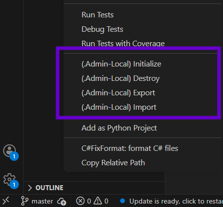
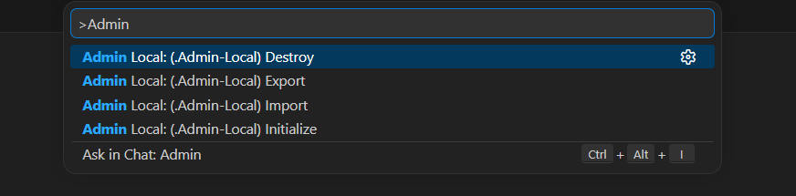
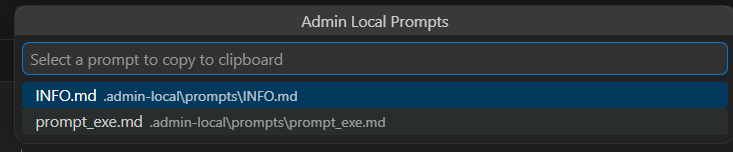
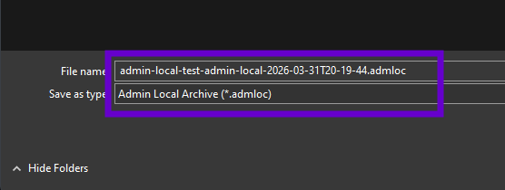

# Admin Local

**Portable AI workflow toolkit**

Your personal developer toolbox — API keys, prompts, scripts, and credentials — available in every project, automatically excluded from Git. Export and import your entire setup between projects in seconds. Built for AI developers, vibe-coders, and multi-project workflows.

---

## Purpose

Admin Local solves a critical problem: **managing sensitive configuration across multiple projects without compromising security.**

Every developer working with AI APIs, cloud services, or databases needs API keys, prompts, deployment scripts, and credentials in each project—but cannot commit them to Git. This extension provides a **Git-safe, portable solution** for consistent workflows.

## Use Cases

- **AI Development** — API keys, prompt templates, LLM test scripts
- **Cloud & DevOps** — IAM credentials, deployment scripts, environment configs
- **Database Work** — Connection strings, seed data, migration scripts
- **Frontend Development** — Auth tokens, feature flags, local environment variables
- **Enterprise & Multi-Project** — Portable setup across teams and repositories
- **Freelance & Contract Work** — Carry your toolchain between client projects

---

## Folder Structure


```
.admin-local/
  ├── README.md
  ├── .ai.store          # API keys (OpenAI, Anthropic, Gemini, etc.)
  ├── docs/              # AI planning documents and task lists
  ├── key-store/         # Secure credentials storage
  ├── prompts/           # Reusable AI prompts
  └── scripts/           # Automation utilities
```

---

## Commands

### Right-click command menu for quick easy access



All commands available via **right-click** or **Command Palette** (`Ctrl+Shift+P`).



### (.Admin-Local) Initialize

Creates `.admin-local` folder structure and adds to `.git/info/exclude`.

### (.Admin-Local) Export

Creates timestamped `.admloc` archive: `project-name-admin-local-2026-03-30T14-25-10.admloc`

### (.Admin-Local) Import

Restores from `.admloc` archive.

### (.Admin-Local) Copy Prompt to Clipboard

Opens a searchable prompt picker at the top of VS Code. Select a prompt → copied to clipboard → paste directly into VS Code Chat or any AI tool.



### (.Admin-Local) Destroy

Permanently deletes `.admin-local` folder (confirmation required).

---

## Custom File Type

Admin Local uses a custom `.admloc` archive format for portable export and import.



Archives are timestamped and zipped: `project-name-admin-local-2026-03-31T20-19-44.admloc`

---

## Quick Start

1. **Right-click in Explorer** → `(.Admin-Local) Initialize`
2. Add your API keys to `.admin-local/.ai.store`
3. Create prompts in `.admin-local/prompts/`
4. **Export** when done → Move to next project → **Import**

---

## Security

- **Git-safe**: Uses `.git/info/exclude` (local-only, never committed)
- **No telemetry**: Your data never leaves your machine
- **Export control**: Only `.admin-local/` contents included in archives

---

## Requirements

- VS Code 1.109.0+
- Git repository
- Git CLI installed

---

## Installation

**From VSIX:**  
Extensions → `...` → Install from VSIX → Select `admin-local-0.0.1.vsix`

**From Marketplace** (coming soon):  
Search "Admin Local"

---

## License

MIT License
**Created by Shaun Allen Pritchard**
