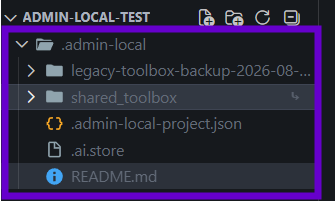
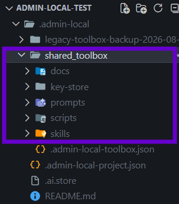
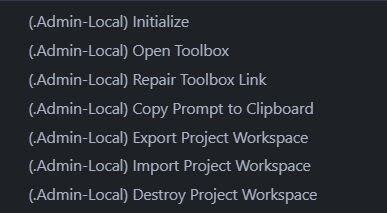
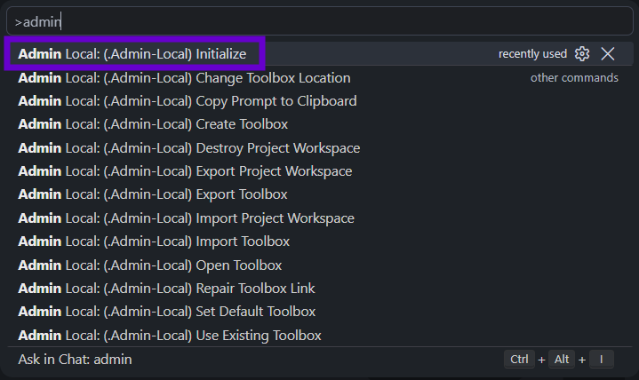
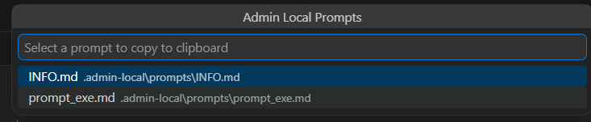
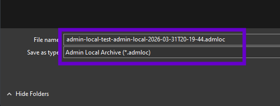
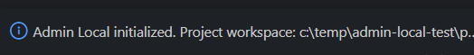
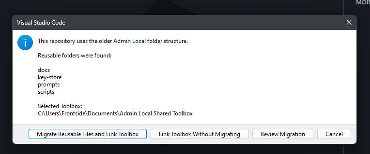
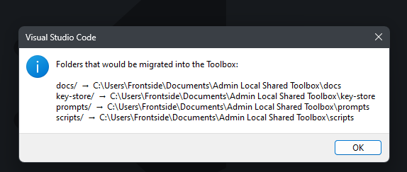
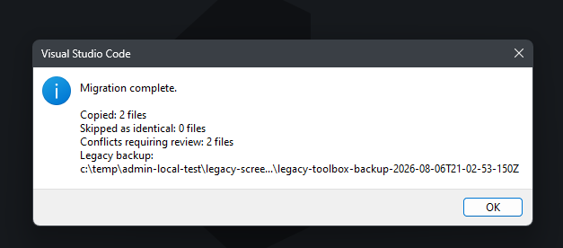

# Admin Local

**Portable AI workflow toolkit — with one shared Toolbox across every project**

Every Git repository gets its own private `.admin-local` workbench for project-specific work (ticket folders, scratch analysis, local API keys). Inside that workbench, `shared_toolbox` is a doorway into one permanent, computer-wide **Admin Local Shared Toolbox** holding your reusable prompts, scripts, docs, key store, and skills. Edit a script from any project and every other project sees the change immediately — nothing is copied or synced, it's the same physical file.

---

## Purpose

Admin Local solves a critical problem: **managing sensitive configuration and reusable engineering resources across multiple projects, without compromising security or duplicating files.**

Every developer working with AI APIs, cloud services, or databases needs API keys, prompt templates, deployment scripts, and credentials across projects — but cannot commit them to Git, and shouldn't have to maintain a separate copy per repository. This extension provides a **Git-safe, centralized solution** for a consistent toolkit that follows you between projects.

## Use Cases

- **AI Development** — API keys, prompt templates, LLM test scripts
- **Cloud & DevOps** — IAM credentials, deployment scripts, environment configs
- **Database Work** — Connection strings, seed data, migration scripts
- **Frontend Development** — Auth tokens, feature flags, local environment variables
- **Enterprise & Multi-Project** — One toolkit shared across every repository on the machine
- **Freelance & Contract Work** — Carry your toolchain between client projects without copy-pasting it

---

## Folder Model

```
Documents/
└── Admin Local Shared Toolbox/     ← one real folder on the computer
    ├── docs/
    ├── key-store/
    ├── prompts/
    ├── scripts/
    └── skills/

my-repository/
└── .admin-local/                   ← private to this repository
    ├── README.md
    ├── .ai.store                   ← project-local API keys
    ├── .admin-local-project.json
    ├── shared_toolbox/             ← filesystem link, not a copy
    ├── BP-1427-fix-callback/       ← ticket/work-item scratch folders
    └── BP-1518-test-pipeline/
```

`shared_toolbox` looks and behaves like a normal folder in VS Code Explorer, but it is a filesystem link (a directory junction on Windows, a symbolic link on macOS/Linux) pointing at the one physical Toolbox. Editing `project-a/.admin-local/shared_toolbox/scripts/test.js` and `project-b/.admin-local/shared_toolbox/scripts/test.js` both edit `Documents/Admin Local Shared Toolbox/scripts/test.js` — the same file.

The normal setup uses **one Toolbox per computer**, created automatically the first time you initialize a repository. On Windows the default location is `C:\Users\<you>\Documents\Admin Local Shared Toolbox`; on macOS/Linux it's `~/Documents/Admin Local Shared Toolbox`. That's only a suggestion — you can point it anywhere during first-time setup, and move it later with **(.Admin-Local) Change Toolbox Location**. The extension also supports multiple named Toolboxes (e.g. Personal, Client A) if you need to keep separate sets of resources — see [COMMANDS.md](COMMANDS.md) for the full breakdown.

**What this looks like in practice:**





---

## Commands

Short version below; for what each command actually does step by step (including what dialogs to expect), see **[COMMANDS.md](COMMANDS.md)**.

### Right-click command menu for quick easy access



All commands are available via **right-click** in the Explorer or the **Command Palette** (`Ctrl+Shift+P`).



### Project commands (Explorer + Command Palette)

| Command | What it does |
|---|---|
| **(.Admin-Local) Initialize** | Creates `.admin-local`, sets up the Toolbox on first use, links `shared_toolbox`, adds `.admin-local/` to `.git/info/exclude`. Offers a one-time migration wizard for repositories created by older versions. |
| **(.Admin-Local) Open Toolbox** | Reveals the physical Toolbox folder in your OS file browser. |
| **(.Admin-Local) Repair Toolbox Link** | Re-creates `shared_toolbox` if it's missing or broken. Never deletes a real file or folder automatically. |
| **(.Admin-Local) Copy Prompt to Clipboard** | Searches `shared_toolbox/prompts/**` and any project ticket folder containing a `prompts`/`prompt` folder; copies the selected prompt to your clipboard. |
| **(.Admin-Local) Export Project Workspace** | Archives this repository's project-local `.admin-local` content (never the Toolbox) to a `.admloc` file. |
| **(.Admin-Local) Import Project Workspace** | Restores project-local content from a `.admloc` archive. Never writes through the Toolbox link. |
| **(.Admin-Local) Destroy Project Workspace** | Removes this repository's `.admin-local` workbench. The Toolbox link is unlinked, never deleted as a real folder — the shared Toolbox itself is untouched. |

### Toolbox administration (Command Palette)

| Command | What it does |
|---|---|
| **(.Admin-Local) Create Toolbox** | Creates a new physical Toolbox at a location you choose. |
| **(.Admin-Local) Use Existing Toolbox** | Registers an existing Toolbox folder (e.g. after reinstalling VS Code). |
| **(.Admin-Local) Set Default Toolbox** | Chooses which registered Toolbox new repositories use by default. |
| **(.Admin-Local) Change Toolbox Location** | Repoints a registered Toolbox at a new physical folder and offers to repair the current project's link. |
| **(.Admin-Local) Export Toolbox** | Archives an entire physical Toolbox — a separate, explicit action from a project export. |
| **(.Admin-Local) Import Toolbox** | Merges an archive into an existing Toolbox (skipping identical files, isolating conflicts) or creates a new Toolbox from it. |



---

## Custom File Type

Admin Local uses a custom `.admloc` archive format for portable export and import — one format for project-workspace archives, and a separate one for Toolbox archives.



Archives are timestamped and zipped, e.g. `project-name-admin-local-2026-08-06T18-30-00.admloc`.

---

## Quick Start

1. **Right-click in Explorer** → `(.Admin-Local) Initialize`
2. First time on this computer: accept the recommended Toolbox location (or choose your own)
3. Add reusable prompts/scripts to `shared_toolbox/`; keep ticket-specific scratch work in its own folder inside `.admin-local/`
4. Add project-local API keys to `.admin-local/.ai.store`
5. Open another repository and initialize it — it automatically links to the same Toolbox



---

## Upgrading from an Older Version

If a repository was initialized by a version of Admin Local that created `docs/`, `key-store/`, `prompts/`, and `scripts/` directly inside `.admin-local`, the next time you run **Initialize** on it, a one-time migration wizard walks you through moving those folders into the centralized Toolbox:



Choosing **Review Migration** first shows exactly where each folder would go, with no changes made yet:



Choosing **Migrate Reusable Files and Link Toolbox** copies new files into the Toolbox, skips any that are already identical, and isolates any that conflict (nothing is ever silently overwritten) — then reports exactly what happened:



The original folders are preserved in a timestamped `legacy-toolbox-backup-...` folder inside `.admin-local` — nothing is deleted automatically, and this wizard only runs once per repository.

---

## Security

- **Git-safe**: Uses `.git/info/exclude` (local-only, never committed), resolved through Git itself so worktrees and `.git` pointer files work correctly
- **No telemetry**: Your data never leaves your machine
- **Export control**: Project exports never include the Toolbox link or its target; Toolbox exports are a separate, explicit command
- **No silent overwrites**: Migration and import operations skip identical files, isolate conflicting ones, and never delete a real file or directory automatically

---

## Requirements

- VS Code 1.109.0+
- Git repository (local — remote/SSH/Codespaces/Dev Containers/WSL workspaces are not yet supported)
- Git CLI installed

## Platform Support

Admin Local is implemented for Windows, macOS, and Linux: the Toolbox link is a directory **junction** on Windows and a real directory **symbolic link** on macOS/Linux, and the recommended Toolbox location on all three is `~/Documents/Admin Local Shared Toolbox`.

Windows is the platform this has been hands-on tested on so far (migration, linking, and the full Initialize flow all verified against real repositories). The macOS/Linux code paths are implemented and covered by the same automated test suite, but haven't yet been run on an actual Mac or Linux machine. If you're on macOS or Linux, the extension should work identically — please [open an issue](https://github.com/shaungt1/admin-local-vscode-/issues) if anything behaves differently than described here.

---

## Installation

**From VSIX:**
Extensions → `...` → Install from VSIX → Select the `.vsix` file

**From Marketplace:**
Search "Admin Local"

Already have an older version installed? Just update normally — see [CHANGELOG.md](CHANGELOG.md) for what changes on upgrade. Your existing `.admin-local` folders are left untouched until you next run an Admin Local command in that repository.

---

## License

MIT License
**Created by Shaun Pritchard**
